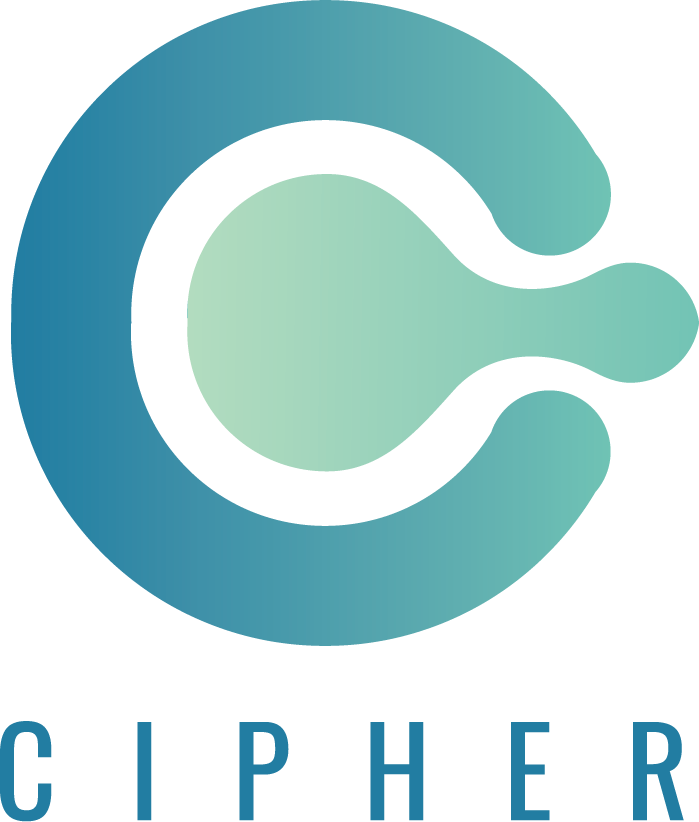

 
# Project Cipher

I wanted to have something which helps me to store my notes or chapters from web to mobile anywhere online or offline.
Cipher is here to help you out.

## This is the backend integration

Implmented using MongoDB and node js. There is also a front-end version of this reader. ( will upadate link soon )

### Why I should Use this

[x] we will provide proper encryption to your text so your information stays safe. 
[x] This is simple Note saving application that we can use from both PC and Mobile App using PWA. 
[x] OFFLINE SUPPORT. 

## API

### User API

##### User Auth

`curl --request POST \ --url http://localhost:5001/userAuth \ --header 'content-type: application/json' \ --data '{"username":"username", "password": "password"}'`

##### User Register

`curl --request POST \ --url http://localhost:5001/user \ --header ' content-type: application/json' \ --header 'content-type: application/json' \ --data '{"username":"username", "password": "password" }'`

##### User Edit

`curl --request PUT \ --url 'http://localhost:5001/user?username="give old username""' \ --header ' content-type: application/json' \ --header 'content-type: application/json' \ --data '{"username":"userName to update", "password": "password if need update", "storedPassword": "old password" }'`

##### User Delete

`curl --request DELETE \ --url http://localhost:5001/user \ --header ' content-type: application/json' \ --header 'content-type: application/json' \ --data '{"username":"username", "storedPassword": "user saved password" }'`

### Notes API

##### Note Add

`curl --request POST \ --url http://localhost:5001/notes \ --header ' content-type: application/json' \ --header 'content-type: application/json' \ --data '{"username":"user name", "notesData": {"data": "ranodm", "id": "ranodm", "nigga": false} || "random string", "notesTitle": "Test Notes", "storedPassword": "old stored pass" }'`

##### Get Notes of Specific User

`curl --request GET \ --url 'http://localhost:5001/getUserNotes?username=username&storedPassword=userPass' \ --header ' content-type: application/json' \ --header 'content-type: application/json'`

Have a Feature Idea? feel free to add a [Issue](https://github.com/sazzadsazib/cipher-be/issues)

Please check Licence before using this product (c) Sazzad Sazib 2019
